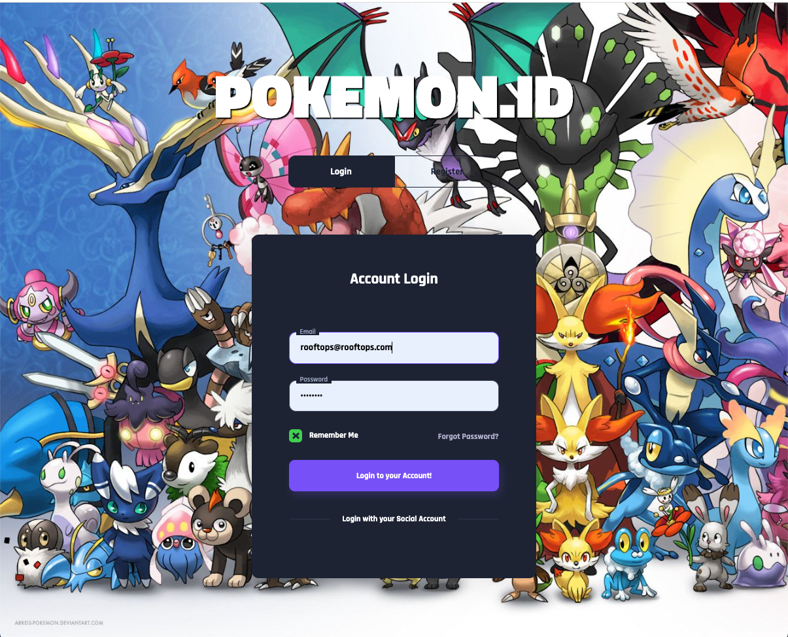

# pokemon-id

Pocket Monster (Pokemon) Identification System
<b>Pokemon.ID</b> is a Web Application that utilizes API data from <a href="https://github.com/PokeAPI">PokeAPI</a> is a user-friendly application that allows users to browse and search through a comprehensive database of Pokemon characters. Built using HTML, CSS, and JavaScript, the app retrieves data from the [PokeAPI](https://pokeapi.co/) to provide detailed information about each Pokemon including its type, abilities, stats, and evolutions.

### Features

- Search for Pokemon by name or ID
- Filter Pokemon by type
- View detailed information about each Pokemon, including its abilities, and stats
- Search for a Pokemom (name, type1, type2, base point, pokedex ID)
- Favorite a Pokemon
- Create a new Pokemon to the database
- Edit a Pokemon in the database
- Ability to upload profile picture

In addition to providing valuable information about each Pokemon character, the app offers an engaging and interactive user experience. Users can easily navigate between related Pokemon using the evolution chain and explore the vast world of Pokemon with ease.

### Technologies Used
- HTML
- CSS
- JavaScript
- [PokeAPI](https://pokeapi.co/)

Pokemon.ID represents the perfect platform for fans of the Pokemon franchise who want to learn more about their favorite characters and expand their knowledge about the world of Pokemon.

# HOW TO INSTALL
1. `Fork` and `Clone` this repository to your local machine.
2. Create your `.env` file in the root of the application
3. Import models `sequelize db:migrate`
4. Seed the database with Pokemon data `sequelize db:seed:all`
5. Run `npm run dev` to start server.
6. localhost:8000 in your broswer to see app

# Main used route
List all Pokemon: /pokemon
View favorites list: /favorites
Advanced Pokemon search: /search
Query Pokemon by name: /pokemon/: name
Query Pokemon by name: /pokemon/id/ :gameindex number
Query Pokemon by types: /pokemon/type-1/ :type
Query Pokemon by types: /pokemon/type-2/ :type

# Dependencies

axios: ^1.4.0
bcryptjs: ^2.4.3
connect-flash: ^0.1.1
dotenv: ^16.0.2
ejs: ^3.1.9
ejs-layouts: ^0.0.1
express: ^4.18.2
express-ejs-layouts: ^2.5.1
express-router: ^0.0.1
express-session: ^1.17.3
method-override: ^3.0.0
multer: ^1.4.5-lts.1
node: ^20.2.0
passport: ^0.6.0
passport-local: ^1.0.0
pg: ^8.11.0
pg-hstore: ^2.3.4
sequelize: ^6.31.1
sequelize-cli: ^6.6.1
supertest: ^6.3.3

# Todo/Chores

1. Implement new UX
2. Add user messaging and private messages
3. Add Social OAUTH login
4. Add Navigate between related Pokemon using the evolution chain
